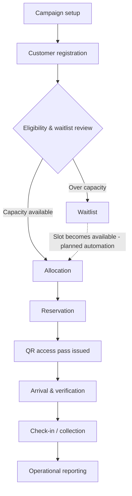
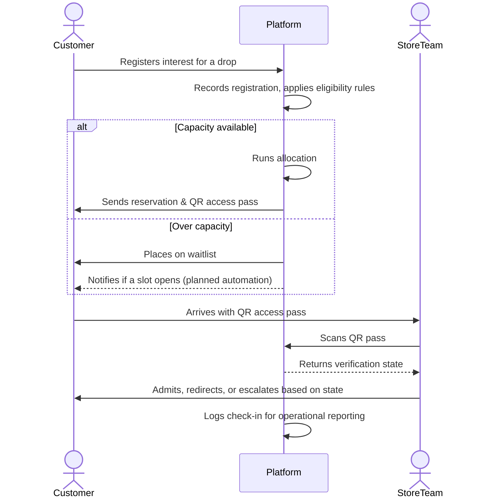
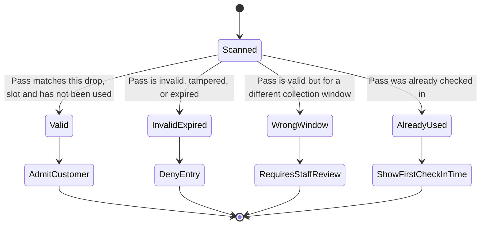
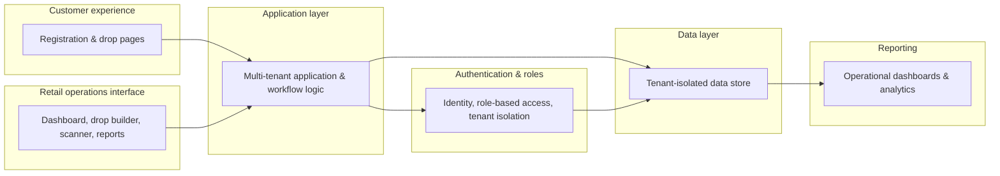

# DropOS

**Operational infrastructure for high-demand retail launches.**

DropOS helps retailers coordinate registration, allocation, reservations, QR
verification and launch-day operations from one controlled workflow.

---

## The operational problem

High-demand retail moments (limited product drops, pop-up launches,
in-store activations) routinely break down under their own demand: long
physical queues, overcrowding, reseller abuse, inventory overselling, and a
degraded customer experience at exactly the moment a retailer most wants to
impress its best customers.

Retailers running these moments today typically stitch together a
registration form, a spreadsheet, a generic ticketing tool and a manual
door list. None of these tools were built for the specific mechanics of a
retail drop: inventory-bound allocation, timed collection, and in-person
verification under pressure.

## Target users

- **Retailers and brands** running limited-release product drops
- **Mall operators** hosting high-footfall pop-up activations
- **Activation agencies** running launch events on behalf of brands
- **Store operations teams** who need calm, mobile-first tools on the day

## Why high-demand launches break down

- Demand is front-loaded and time-boxed: traffic arrives in a single spike, not a curve
- Registration and inventory are usually managed in disconnected tools
- There is no reliable way to prove a customer is who they say they are, or where they belong in line
- Staff have no real-time visibility into who should be admitted, when, or why
- Reseller and duplicate-entry abuse actively degrades the experience for genuine customers

## The DropOS solution

DropOS manages the full lifecycle of a drop, from campaign setup through
registration, allocation, reservation, verified collection, and post-event
reporting, as one connected workflow instead of a chain of disconnected
tools.

### Drop lifecycle

*The dotted line from Waitlist back to Allocation represents the intended
product model. Automatic promotion from the waitlist is planned; it is
not yet a fully automated part of the shipped product today.*

## Core product workflows

Implementation maturity varies across these workflows. See
[Capability status](#capability-status) below for specifics.

- **Registration**: a branded, mobile-first page where customers register
  interest in a drop, with configurable eligibility rules
- **Waitlisting**: the product model supports waitlisted demand, with
  further automation around promotion and release management still
  planned
- **Allocation**: DropOS is being developed to support controlled
  allocation approaches, including first-come-first-served and
  raffle-based releases. Implementation maturity varies by allocation
  type
- **Reservation and collection windows**: reservation and
  collection-window workflows are part of the product model and remain
  under active development
- **QR access passes**: each customer receives a unique, time-boxed access
  pass rather than a static code that could be shared or screenshotted
- **Arrival verification**: store staff scan the pass and get a clear
  operational outcome instead of a judgment call
- **Operational reporting**: retailers can see registration, allocation
  and check-in activity throughout a live event, not only after it closes

### Registration-to-check-in workflow

*Waitlist notification on slot release is part of the designed model;
automatic promotion is still planned rather than fully live today.*

### QR verification states

Rather than a binary valid/invalid scan, store staff see one of four clear
operational states:

*A staff override capability for the "wrong collection window" state is
part of the designed model; the in-scanner override interface itself is
still being completed.*

## Product principles

- **Calm operations under high demand**: the platform is designed so a
  spike in customer traffic doesn't become a spike in staff stress
- **Fair and auditable allocation**: every allocation decision is
  recorded, not just applied
- **Mobile-first staff tools**: the in-store scanner is built for
  one-handed use on a real device, not adapted from a desktop dashboard
- **Strong tenant isolation**: one retailer's data is never visible to
  another, enforced at the data layer, not only in application logic
- **Clear operational states**: every registration, invite and check-in
  has an explicit, visible status rather than an implied one
- **Retailers remain the merchant of record**: DropOS is designed so
  customer payments are intended to flow directly to the retailer rather
  than through DropOS
- **White-label foundations**: configurable branding (logo, colour) is
  implemented today; broader self-service custom-domain workflows remain
  in development
- **Overrides are designed to be accountable**: the product model treats
  a staff override of an unusual verification state as part of the
  record, not a silent exception; the in-scanner override interface is
  still being completed

## Safe architecture overview

DropOS is built as a multi-tenant web application with role-based access
control checked at multiple layers, and tenant data isolation enforced at
the database layer rather than relying on application code alone. Access
passes are cryptographically signed and time-boxed rather than static
codes. Implementation detail beyond this level (schema, security policy
code, and allocation internals) is intentionally not included here; see
[`NOTICE.md`](NOTICE.md).

## My role

Founder and product owner. I lead product strategy, operational workflow
design, system requirements, validation and AI-assisted implementation.

## Current product status

DropOS is in active private development. The product is being prepared
for early pilot conversations and has not yet been presented here as a
launched platform with paying retail customers.

### Capability status

| Area | Public status |
|---|---|
| Tenant isolation and role controls | Implemented |
| Customer registration | Implemented |
| First-come-first-served allocation | Implemented |
| Raffle allocation | Partially implemented |
| QR verification and check-in | Implemented |
| Store operations and reporting | Partially implemented |
| Automated waitlist promotion | Planned |
| Reservation and collection-window configuration | Under development |
| White-label branding | Foundations implemented |
| Self-service payment onboarding | Under development |

## Future direction

The items below describe product direction, not delivery commitments.
No dates, estimates, or customer commitments are implied.

**Current focus**: closing gaps in the core registration → allocation →
verification → check-in loop, strengthening self-serve white-label
capability, and continuing to harden operational reporting.

**Near-term direction**: expanding multi-store and multi-door launch
support, broadening anti-abuse protections on public registration, and
deepening post-event analytics.

**Longer-term direction**: public API access, enterprise-readiness
capabilities such as single sign-on, and expansion to additional
notification and payment integrations.

## Documentation

- [`docs/PRODUCT_OVERVIEW.md`](docs/PRODUCT_OVERVIEW.md): the problem and who DropOS is for, in more depth
- [`docs/USER_WORKFLOWS.md`](docs/USER_WORKFLOWS.md): the customer, store-team and retailer-admin experience, walked through
- [`docs/PRODUCT_DECISIONS.md`](docs/PRODUCT_DECISIONS.md): why the product is built the way it is
- [`docs/ARCHITECTURE.md`](docs/ARCHITECTURE.md): a closer look at the safe architecture overview
- [`docs/ROADMAP.md`](docs/ROADMAP.md): where the product is headed next

## Rights and reuse

This repository is a product case study, not the DropOS application source
code. See [`NOTICE.md`](NOTICE.md) for rights and reuse terms.
