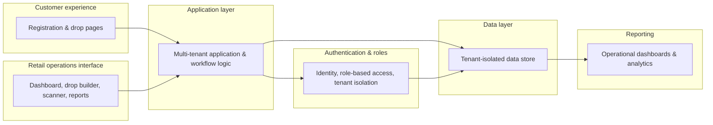

# Architecture Overview

This is a safe, conceptual look at how DropOS is put together, enough to
understand the shape of the system, without exposing implementation
detail that is either commercially sensitive or would help someone
attempt to circumvent the platform's access controls.

## Customer experience

The public-facing side of the platform: branded registration pages and
drop landing pages, themed per retailer. This is what a customer
interacts with directly; no login is required to register interest in a
drop.

## Retail operations interface

The retailer-facing side: a dashboard for configuring drops, managing
registrations and invites, running reports, and a separate purpose-built
scanner interface for store staff during the event itself.

## Application layer

The workflow logic connecting registration, allocation, reservations, and
verification into a single lifecycle per drop. This layer is where a
drop's rules (its eligibility, its capacity, its allocation approach)
are actually applied.

## Authentication & roles

Every person accessing the retail operations interface (a retailer
admin, a store manager, or scanner staff) is authenticated and assigned
a role that determines what they can see and do. Role checks happen at
more than one layer, so a gap in one layer doesn't become a security
hole on its own.

## Data layer

All operational data is isolated per retailer (tenant) at the database
level, not only through application logic. This is the platform's final
backstop against one retailer's data ever becoming visible to another,
deliberately not dependent on every part of the application getting an
access check right.

## Reporting

Registration, allocation and check-in activity feeds operational
dashboards, both live, during an event, and as a historical record
afterwards.

## What's intentionally not covered here

This document does not describe database schema, row-level security
policy definitions, the QR signing implementation, allocation algorithm
internals, or anti-abuse detection logic. Those are commercially
sensitive and, in some cases, would be counterproductive to publish
publicly since they would help someone attempt to work around them.
